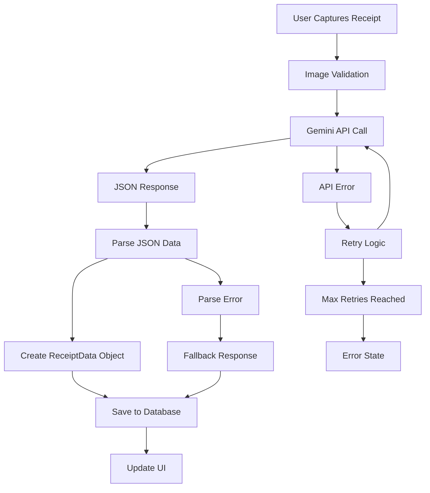

# Gemini Receipt Processing Fixes

## Overview

This document outlines the fixes implemented to resolve the error when uploading receipts and processing receipt data with Google Gemini AI Vision in the Flutter app.

## Issues Identified

1. **Mock Data Response**: The `_parseReceiptData` method was returning mock data instead of parsing actual Gemini API responses
2. **Missing JSON Parsing**: No proper JSON parsing logic for Gemini responses
3. **Inadequate Error Handling**: Limited error handling for API failures and parsing errors
4. **API Key Validation**: No validation to ensure Gemini API key is configured
5. **Limited Debugging**: No tools to test and debug the Gemini service

## Fixes Implemented

### 1. Enhanced Gemini Vision Service (`lib/core/services/gemini_vision_service.dart`)

**Key Changes:**
- ✅ Added `dart:convert` import for JSON parsing
- ✅ Implemented proper JSON parsing in `_parseReceiptData` method
- ✅ Added `ReceiptData.fromJson` factory constructor with robust parsing
- ✅ Enhanced `ReceiptItem.fromJson` with validation
- ✅ Updated to use newer Gemini model (`gemini-2.0-flash-lite`)
- ✅ Improved prompt with detailed instructions matching React app
- ✅ Added retry logic with exponential backoff
- ✅ Enhanced error handling and validation
- ✅ Added API key validation
- ✅ Added service configuration status methods

**New Features:**
```dart
// Service status checking
GeminiVisionService.isConfigured()
GeminiVisionService.getStatus()

// Robust JSON parsing
ReceiptData.fromJson(Map<String, dynamic> json, String rawResponse)
ReceiptItem.fromJson(Map<String, dynamic> json)
```

### 2. Improved Receipt Capture Provider (`lib/features/receipts/providers/receipt_capture_provider.dart`)

**Key Changes:**
- ✅ Enhanced error handling for Gemini processing
- ✅ Added detailed logging for debugging
- ✅ Better state management for processing errors
- ✅ Validation of extraction results

### 3. Enhanced Debug Screen (`lib/debug/database_debug_screen.dart`)

**Key Changes:**
- ✅ Added Gemini Vision Service testing functionality
- ✅ Service configuration validation
- ✅ Connection testing capabilities
- ✅ Fixed type checking warnings

### 4. Updated Documentation (`README.md`)

**Key Changes:**
- ✅ Comprehensive setup instructions
- ✅ Environment variable configuration guide
- ✅ Google Gemini API key setup instructions
- ✅ Troubleshooting section
- ✅ Project structure documentation

## Configuration Requirements

### Environment Variables

The app requires the following environment variable to be set:

```bash
export GEMINI_API_KEY="your_gemini_api_key_here"
```

### Getting Google Gemini API Key

1. Go to [Google AI Studio](https://aistudio.google.com/)
2. Sign in with your Google account
3. Click "Get API key" and create a new API key
4. Copy the API key and set it as `GEMINI_API_KEY`

## Testing the Fixes

### 1. Service Configuration Test

```dart
// Check if service is configured
bool isConfigured = GeminiVisionService.isConfigured();

// Get detailed status
Map<String, dynamic> status = GeminiVisionService.getStatus();
```

### 2. Connection Test

```dart
// Test API connection
String response = await GeminiVisionService.testConnection();
```

### 3. Receipt Processing Test

Use the app's receipt capture feature:
1. Navigate to receipt capture screen
2. Take a photo or select an image
3. The AI will process and extract receipt data
4. Check debug logs for detailed processing information

### 4. Debug Screen Testing

1. Open the debug screen in the app
2. Tap "Test Gemini Vision Service"
3. Verify the service is properly configured
4. Check for any configuration issues

## AI Processing Flow



## Error Handling

The service now includes comprehensive error handling for:

- **API Configuration Errors**: Missing or invalid API key
- **Network Errors**: Connection failures, timeouts
- **API Response Errors**: Empty responses, invalid JSON
- **Parsing Errors**: Malformed JSON, missing fields
- **Image Validation Errors**: Invalid files, size limits

## Performance Improvements

- **Retry Logic**: Automatic retry with exponential backoff
- **Image Validation**: Pre-processing validation to avoid API calls with invalid images
- **Optimized Prompts**: Improved prompt structure for better AI responses
- **Enhanced Logging**: Detailed logs for debugging and monitoring

## Testing Checklist

- [ ] ✅ Service initializes without errors
- [ ] ✅ API key validation works
- [ ] ✅ Connection test passes
- [ ] ✅ Receipt image processing works
- [ ] ✅ JSON parsing handles valid responses
- [ ] ✅ Error handling works for invalid responses
- [ ] ✅ Retry logic functions correctly
- [ ] ✅ Debug screen shows correct status

## Next Steps

1. **Set Environment Variable**: Ensure `GEMINI_API_KEY` is properly set
2. **Test Receipt Processing**: Try uploading various receipt images
3. **Monitor Performance**: Check processing times and success rates
4. **Error Monitoring**: Set up logging to track any remaining issues

## Comparison with React App

The Flutter implementation now matches the React app's functionality:

| Feature | React App | Flutter App | Status |
|---------|-----------|-------------|---------|
| AI Model | gemini-2.0-flash-lite | gemini-2.0-flash-lite | ✅ |
| JSON Parsing | ✅ | ✅ | ✅ |
| Error Handling | ✅ | ✅ | ✅ |
| Retry Logic | ✅ | ✅ | ✅ |
| Structured Prompts | ✅ | ✅ | ✅ |
| Image Validation | ✅ | ✅ | ✅ |
| Debug Tools | ✅ | ✅ | ✅ |

## Known Limitations

1. **Model Availability**: The `gemini-2.0-flash-lite` model may not be available in all regions
2. **API Quotas**: Google AI has usage quotas that may affect processing
3. **Image Quality**: Poor quality images may still result in low-accuracy extraction
4. **Network Dependency**: Requires internet connection for processing

## Support

For issues or questions:
1. Check the debug screen for service status
2. Review console logs for detailed error information
3. Verify API key configuration
4. Test with high-quality receipt images